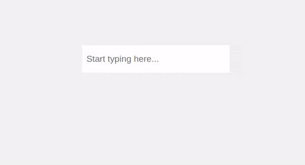

# better-react-transliterate

SSR-friendly transliteration input for React with support for 30+ languages via Google Input Tools.

<p align="center">
  
</p>

## Why this fork

`better-react-transliterate` keeps the same `ReactTransliterate` API, but ships styles as an external stylesheet instead of importing CSS from the component entrypoint. That makes it much friendlier for SSR setups such as Next.js, Remix, and other Node-based React builds.

## Install

```bash
npm install better-react-transliterate
```

```bash
yarn add better-react-transliterate
```

```bash
pnpm add better-react-transliterate
```

## Import styles

Import the package stylesheet once in your app entry:

```tsx
import "better-react-transliterate/styles.css";
```

If your bundler prefers a direct file path, this also works:

```tsx
import "better-react-transliterate/dist/index.css";
```

## Usage

### Basic example

```tsx
import React, { useState } from "react";
import { ReactTransliterate } from "better-react-transliterate";
import "better-react-transliterate/styles.css";

export default function App() {
  const [text, setText] = useState("");

  return (
    <ReactTransliterate
      value={text}
      onChangeText={setText}
      lang="hi"
      placeholder="Start typing here..."
    />
  );
}
```

### With textarea

```tsx
import React, { useState } from "react";
import { ReactTransliterate } from "better-react-transliterate";
import "better-react-transliterate/styles.css";

export default function App() {
  const [text, setText] = useState("");

  return (
    <ReactTransliterate
      renderComponent={(props) => <textarea {...props} />}
      value={text}
      onChangeText={setText}
      lang="hi"
    />
  );
}
```

### With TypeScript

```tsx
import React, { useState } from "react";
import {
  ReactTransliterate,
  Language,
} from "better-react-transliterate";
import "better-react-transliterate/styles.css";

export default function App() {
  const [text, setText] = useState("");
  const [lang, setLang] = useState<Language>("hi");

  return (
    <ReactTransliterate
      value={text}
      onChangeText={setText}
      lang={lang}
    />
  );
}
```

### With Material UI

```tsx
import React, { useState } from "react";
import Input from "@material-ui/core/Input";
import {
  ReactTransliterate,
  Language,
} from "better-react-transliterate";
import "better-react-transliterate/styles.css";

export default function App() {
  const [text, setText] = useState("");
  const [lang, setLang] = useState<Language>("hi");

  return (
    <ReactTransliterate
      renderComponent={(props) => {
        const inputRef = props.ref;
        delete props.ref;
        return <Input {...props} inputRef={inputRef} />;
      }}
      value={text}
      onChangeText={setText}
      lang={lang}
    />
  );
}
```

## SSR notes

For frameworks such as Next.js:

1. Import `better-react-transliterate/styles.css` once in `app/layout.tsx`, `pages/_app.tsx`, or another top-level client entry.
2. Render `ReactTransliterate` from a client component because it uses React state and input event handlers.

Example:

```tsx
// app/layout.tsx
import "better-react-transliterate/styles.css";
```

```tsx
// app/components/transliteration-input.tsx
"use client";

import { useState } from "react";
import { ReactTransliterate } from "better-react-transliterate";

export function TransliterationInput() {
  const [text, setText] = useState("");

  return (
    <ReactTransliterate
      value={text}
      onChangeText={setText}
      lang="hi"
    />
  );
}
```

## Custom trigger keys

`triggerKeys` uses `event.key` values. The package exports a few common defaults through `TriggerKeys`.

```tsx
import React, { useState } from "react";
import {
  ReactTransliterate,
  TriggerKeys,
} from "better-react-transliterate";
import "better-react-transliterate/styles.css";

export default function App() {
  const [text, setText] = useState("");

  return (
    <ReactTransliterate
      value={text}
      onChangeText={setText}
      lang="hi"
      triggerKeys={[
        TriggerKeys.KEY_RETURN,
        TriggerKeys.KEY_ENTER,
        TriggerKeys.KEY_SPACE,
        TriggerKeys.KEY_TAB,
      ]}
    />
  );
}
```

## Get transliteration suggestions

```tsx
import { getTransliterateSuggestions } from "better-react-transliterate";

const suggestions = await getTransliterateSuggestions("namaste", {
  numOptions: 5,
  showCurrentWordAsLastSuggestion: true,
  lang: "hi",
});
```

## Props

| Prop                             | Required | Default                                     | Description |
| -------------------------------- | -------- | ------------------------------------------- | ----------- |
| `onChangeText`                   | Yes      | -                                           | Listener for the current text value. |
| `value`                          | Yes      | -                                           | Controlled value passed to the component. |
| `enabled`                        | No       | `true`                                      | Control whether suggestions are shown. |
| `renderComponent`                | No       | `(props) => <input {...props} />`           | Custom input component renderer. |
| `lang`                           | No       | `"hi"`                                      | Target language code. |
| `maxOptions`                     | No       | `5`                                         | Maximum number of suggestions to show. |
| `offsetY`                        | No       | `10`                                        | Extra vertical space below the caret. |
| `offsetX`                        | No       | `0`                                         | Extra horizontal space from the caret. |
| `containerClassName`             | No       | `""`                                        | Class name for the outer wrapper. |
| `containerStyles`                | No       | `{}`                                        | Inline styles for the outer wrapper. |
| `activeItemStyles`               | No       | `{}`                                        | Inline styles for the active suggestion item. |
| `hideSuggestionBoxOnMobileDevices` | No     | `false`                                     | Hide suggestions on smaller touch devices. |
| `hideSuggestionBoxBreakpoint`    | No       | `450`                                       | Width threshold used with `hideSuggestionBoxOnMobileDevices`. |
| `triggerKeys`                    | No       | `KEY_SPACE`, `KEY_ENTER`, `KEY_RETURN`, `KEY_TAB` | Keys that commit the current suggestion. |
| `insertCurrentSelectionOnBlur`   | No       | `true`                                      | Insert the current selection on blur. |
| `showCurrentWordAsLastSuggestion`| No       | `true`                                      | Show the raw typed word as the last option. |

## Supported languages

| Language              | Code     |
| --------------------- | -------- |
| Amharic               | `am`     |
| Arabic                | `ar`     |
| Bangla                | `bn`     |
| Belarusian            | `be`     |
| Bulgarian             | `bg`     |
| Chinese (Hong Kong)   | `yue-hant` |
| Chinese (Simplified)  | `zh`     |
| Chinese (Traditional) | `zh-hant` |
| French                | `fr`     |
| German                | `de`     |
| Greek                 | `el`     |
| Gujarati              | `gu`     |
| Hebrew                | `he`     |
| Hindi                 | `hi`     |
| Italian               | `it`     |
| Japanese              | `ja`     |
| Kannada               | `kn`     |
| Malayalam             | `ml`     |
| Marathi               | `mr`     |
| Nepali                | `ne`     |
| Odia                  | `or`     |
| Persian               | `fa`     |
| Portuguese (Brazil)   | `pt`     |
| Punjabi               | `pa`     |
| Russian               | `ru`     |
| Sanskrit              | `sa`     |
| Serbian               | `sr`     |
| Sinhala               | `si`     |
| Spanish               | `es`     |
| Tamil                 | `ta`     |
| Telugu                | `te`     |
| Tigrinya              | `ti`     |
| Ukrainian             | `uk`     |
| Urdu                  | `ur`     |
| Vietnamese            | `vi`     |

## Local example

The [`examples/vite-react`](../../examples/vite-react) app is scaffolded with Vite and wired to this package through the pnpm workspace.

## License

MIT © [burhanuday](https://github.com/burhanuday)
